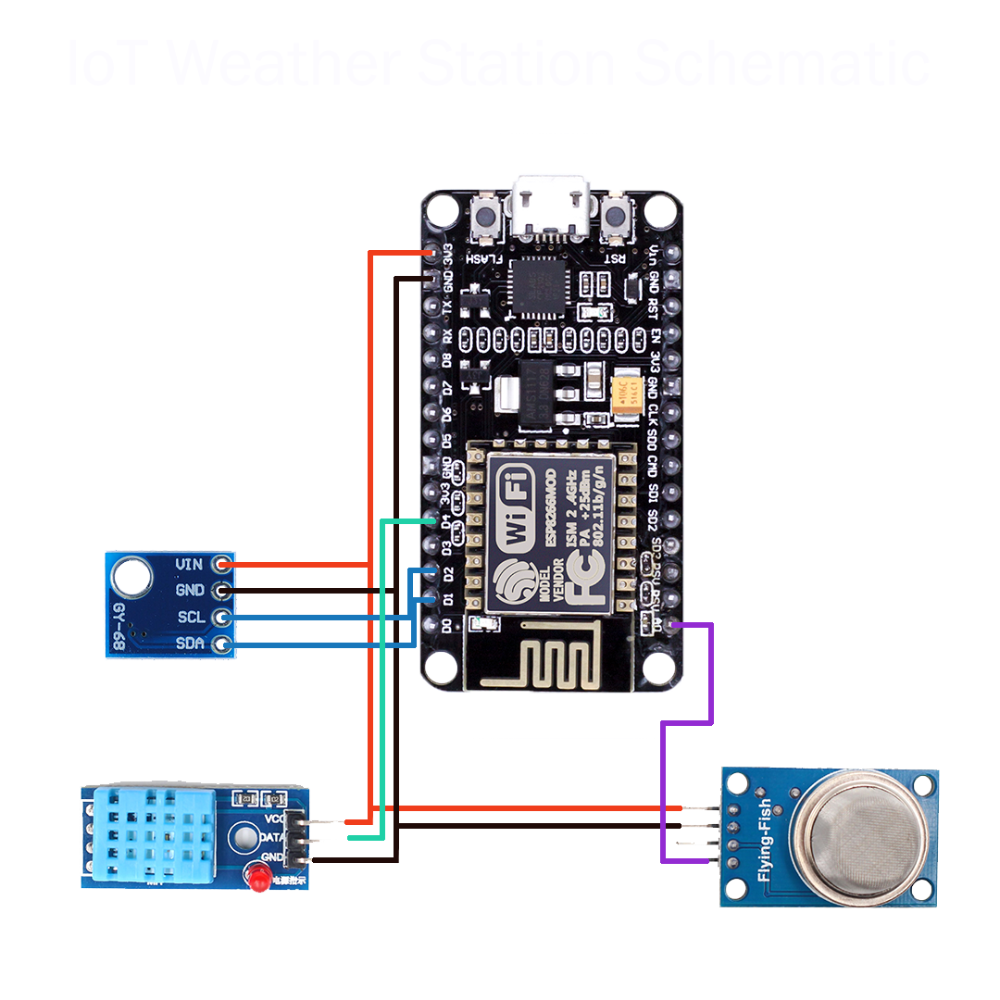

# IoT-Weather-Station-Website

Components used:

-ESP8266 (Node MCU)

-DHT11 (Temperature & Humidity Sensor)

-MQ135 (Gas Sensor for Air Quality)

-BMP180 (Pressure Sensor)

To get the NodeMCU library go to the following link: https://arduino.esp8266.com/Arduino/versions/2.1.0-rc1/doc/installing.html

Then be sure to select NodeMCU V1.0 from the board section in Arduino.

And download Adafruit for BMP180 from Arduino's library management.